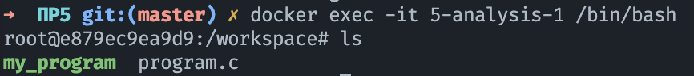

# Практическая работа 5
> Вариант 3. Номер студенческого билета 21Б0953
```c
#include <stdio.h>
#include <unistd.h>

int main(int argc, char *argv[]){
	FILE *secret = fopen("/challenge/app-systeme/ch5/.passwd", "rt");
	char buffer[32];
	fgets(buffer, sizeof(buffer), secret);
	printf(argv[1]);
	fclose(secret);
	return 0;
}
```
## Настройка рабочего пространства
В качестве среды выполнения лабораторной работы запущен docker container с образом операционной системы Ubuntu с установленными утилитами для необходимого языка (gdb для отладки C).
Файл для динамической отладки копируется с хост-машины в volume Docker контейнера;

```Dockerfile
# Базовый образ Ubuntu
FROM ubuntu:18.04

# Установка необходимых утилит
RUN apt-get update && apt-get install -y \
    build-essential \
    gdb \
    nano \
    wget \
    curl \
    vim \
    python3 \
    python3-pip

# Установка дополнительных инструментов (по необходимости)
RUN apt-get install -y \
    strace \
    ltrace \
    valgrind \
    clang-tools

# Добавление рабочей директории
WORKDIR /workspace

# Копирование исходного кода внутрь контейнера
COPY ./src /workspace

CMD ["/bin/bash"]
```




Файл `program.c` скопирован в container.

## Необходимо провести динамическую отладку программного обеспечения с бинарной уязвимостью
### Компиляция программы
Команда ниже осуществляет компиляцию рассматривамой программы на языке C
```bash
gcc -g -o my_program program.c
```


### Запуск программы с отсутствующим файлом
Появляется ошибка SIGSEGV
```bash
root@e879ec9ea9d9:/workspace# gdb ./my_program
GNU gdb (Ubuntu 8.1.1-0ubuntu1) 8.1.1
Copyright (C) 2018 Free Software Foundation, Inc.
License GPLv3+: GNU GPL version 3 or later <http://gnu.org/licenses/gpl.html>
This is free software: you are free to change and redistribute it.
There is NO WARRANTY, to the extent permitted by law.  Type "show copying"
and "show warranty" for details.
This GDB was configured as "aarch64-linux-gnu".
Type "show configuration" for configuration details.
For bug reporting instructions, please see:
<http://www.gnu.org/software/gdb/bugs/>.
Find the GDB manual and other documentation resources online at:
<http://www.gnu.org/software/gdb/documentation/>.
For help, type "help".
Type "apropos word" to search for commands related to "word"...
Reading symbols from ./my_program...done.
(gdb) break main
Breakpoint 1 at 0x8e4: file program.c, line 4.
(gdb) break 8
Breakpoint 2 at 0x920: file program.c, line 8.
(gdb) run test_input
Starting program: /workspace/my_program test_input

Breakpoint 1, main (argc=2, argv=0xfffffffff748) at program.c:4
4       int main(int argc, char *argv[]){
(gdb) next
5               FILE *secret = fopen("/challenge/app-systeme/ch5/.passwd", "rt");
(gdb) next
7               fgets(buffer, sizeof(buffer), secret);
(gdb) next

Program received signal SIGSEGV, Segmentation fault.
_IO_fgets (buf=0xfffffffff5e8 "", n=32, fp=0x0) at iofgets.c:47
47      iofgets.c: No such file or directory.
```
### Запуск программы с нормальным содержимым
```bash
(gdb) break main
Breakpoint 1 at 0xaaaaaaaa08e4: file program.c, line 4.
(gdb) break 8
Breakpoint 2 at 0xaaaaaaaa0920: file program.c, line 8.
(gdb) next
The program is not being run.
(gdb) run test_input
Starting program: /workspace/my_program test_input

Breakpoint 1, main (argc=2, argv=0xfffffffff738) at program.c:4
4       int main(int argc, char *argv[]){
(gdb) next
5               FILE *secret = fopen("/challenge/app-systeme/ch5/.passwd", "rt");
(gdb) step
_IO_new_fopen (filename=0xaaaaaaaa0a10 "/challenge/app-systeme/ch5/.passwd", mode=0xaaaaaaaa0a08 "rt") at iofopen.c:89
89      iofopen.c: No such file or directory.
(gdb) step
__fopen_internal (filename=0xaaaaaaaa0a10 "/challenge/app-systeme/ch5/.passwd", mode=0xaaaaaaaa0a08 "rt", is32=1) at iofopen.c:57
57      in iofopen.c
(gdb) step
65      in iofopen.c
(gdb) continue
Continuing.

Breakpoint 2, main (argc=2, argv=0xfffffffff738) at program.c:8
8               printf(argv[1]);
(gdb) next
9               fclose(secret);
(gdb) print buffer
$1 = "HelloThisIsMyNewPassword\n\000\252\252\252\252\000"
```
### Запуск программы с длинным содержимым
```bash
HelloThisIsMyNamePassworda;lsdkfjas;dlkjfalskjdflkasjdflkjasdlfkjasldkfjalskjdfl;kasjdflkjasdlfkjaslkjfdskaljfdlaksjdflkasjdflkjasdflkjasdklfjaslkdjf
root@e879ec9ea9d9:/workspace# gdb ./my_program
GNU gdb (Ubuntu 8.1.1-0ubuntu1) 8.1.1
Copyright (C) 2018 Free Software Foundation, Inc.
License GPLv3+: GNU GPL version 3 or later <http://gnu.org/licenses/gpl.html>
This is free software: you are free to change and redistribute it.
There is NO WARRANTY, to the extent permitted by law.  Type "show copying"
and "show warranty" for details.
This GDB was configured as "aarch64-linux-gnu".
Type "show configuration" for configuration details.
For bug reporting instructions, please see:
<http://www.gnu.org/software/gdb/bugs/>.
Find the GDB manual and other documentation resources online at:
<http://www.gnu.org/software/gdb/documentation/>.
For help, type "help".
Type "apropos word" to search for commands related to "word"...
Reading symbols from ./my_program...done.
(gdb) break main
Breakpoint 1 at 0x8e4: file program.c, line 4.
(gdb) break 8
Breakpoint 2 at 0x920: file program.c, line 8.
(gdb) run test_input
Starting program: /workspace/my_program test_input

Breakpoint 1, main (argc=2, argv=0xfffffffff738) at program.c:4
4       int main(int argc, char *argv[]){
(gdb) next
5               FILE *secret = fopen("/challenge/app-systeme/ch5/.passwd", "rt");
(gdb) step
_IO_new_fopen (filename=0xaaaaaaaa0a10 "/challenge/app-systeme/ch5/.passwd", mode=0xaaaaaaaa0a08 "rt") at iofopen.c:89
89      iofopen.c: No such file or directory.
(gdb) continue
Continuing.

Breakpoint 2, main (argc=2, argv=0xfffffffff738) at program.c:8
8               printf(argv[1]);
(gdb) print buffer
$1 = "HelloThisIsMyNamePassworda;lsdk"
(gdb) print secret
$2 = (FILE *) 0xaaaaaaab2260
```
## Проанализировать код и сделать кодревью, указав слабые места.
1) В коде считывается содержимое файла с помощью fgets. Однако не проверяется, была ли успешной операция чтения. Если файл отсутствует, недоступен или произошла ошибка, это приведет к неопределенному поведению.
	```c
	fgets(buffer, sizeof(buffer), secret);
	```
2) Это критическая уязвимость, известная как уязвимость форматной строки. Если аргумент argv[1] содержит форматирующие спецификаторы (например, %s, %x, %n), это может привести к чтению или записи в произвольные области памяти. Это представляет собой серьезный риск для безопасности.
	```c
	printf(argv[1]);
	```
3) Нет проверки на наличие аргументов `argv`

## Предложить исправление для кода с целью избежать ошибки
```c
#include <stdio.h>
#include <stdlib.h>

int main(int argc, char *argv[]) {
    // Проверка количества аргументов
    // Если аргумент не передан, выводим сообщение об использовании и завершаем программу
    if (argc < 2) {
        fprintf(stderr, "Usage: %s <input>\n", argv[0]);
        return 1;
    }

    // Проверяем, удалось ли открыть файл
    FILE *secret = fopen("/challenge/app-systeme/ch5/.passwd", "rt");
    if (!secret) { 
        perror("Error opening file"); // Выводим сообщение об ошибке, если файл не найден или недоступен
        return 1;
    }

    char buffer[32];
    
    // Читаем содержимое файла, проверяя успешность операции
    if (fgets(buffer, sizeof(buffer), secret) == NULL) {
        fprintf(stderr, "Error reading file\n"); // Сообщение об ошибке, если файл пустой или произошла ошибка чтения
        fclose(secret);
        return 1;
    }

    // Используем явную форматную строку, чтобы избежать уязвимости форматной строки
    printf("%s\n", argv[1]);

    fclose(secret);

    return 0;
}
```