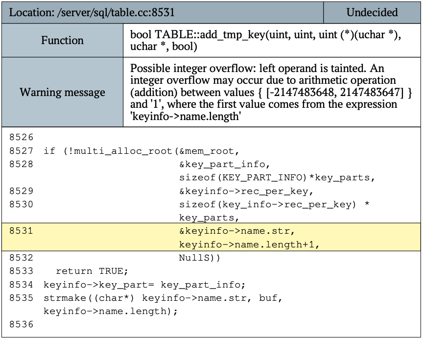

# Практическая работа 5
## Задание на практическую работу


## Выполнение

В этой части кода происходит вызов функции multi_alloc_root, где происходит вычисление keyinfo->name.length + 1 (строка 8531).

Предупреждение о возможном переполнении целого числа связано с тем, что результат сложения этих значений может превышать допустимый диапазон для uint.

### Рассмотрим выражение
```c++
keyinfo->name.length + 1
```

keyinfo->name.length — это длина строки, которая берется из структуры keyinfo (в данном случае предполагается, что это size_t или аналогичный тип, который может представлять довольно большие значения в диапазоне от 0 до UINT_MAX).

Сложение keyinfo->name.length + 1 может привести к переполнению, если результат превышает диапазон целых чисел uint.

### Возможные последствия переполнения
Неадекватное выделение памяти. Если результат сложения выходит за границы допустимого диапазона, это может привести к некорректному выделению памяти, что в свою очередь может вызвать утечки памяти, программные сбои или другие нестабильности.

Ошибки логики приложения. Если код полагается на предполагаемую длину буфера, переполнение может привести к неправильно интерпретированным указателям, что может привести к ошибкам сегментации и другим критическим проблемам.

### Исправление
```c++
size_t max_length = UINT_MAX - 1;
size_t length = keyinfo->name.length;

if (length + 1 > max_length) {
    return FALSE;
}
```

Мы устанавливаем max_length = UINT_MAX - 1, чтобы избежать переполнения.
Проверяем условие length + 1 > max_length для предотвращения превышения допустимого предела.